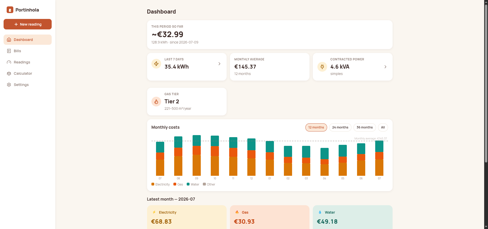
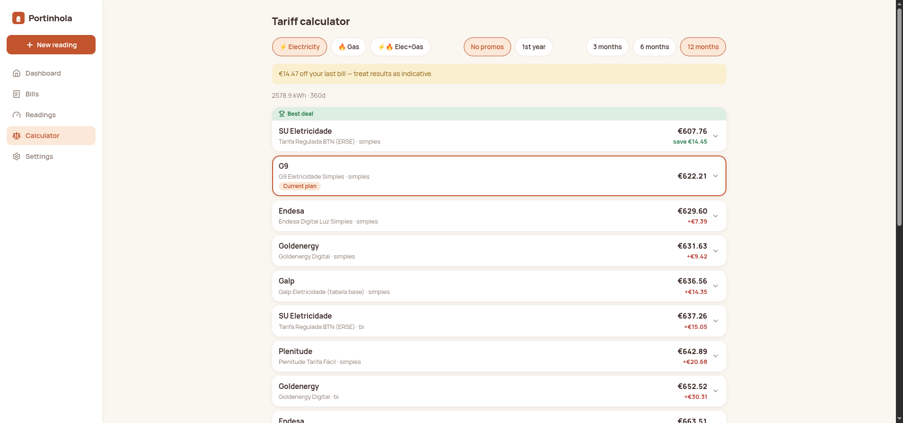
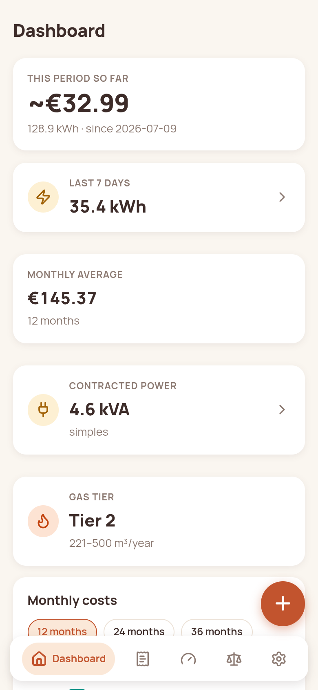

<p align="center">
  
</p>

<h1 align="center">Portinhola</h1>

<p align="center">
  Self-hosted dashboard for Portuguese household utilities:
  electricity, gas and water.
</p>

<p align="center">
  <a href="https://github.com/luisg0nc/portinhola/actions/workflows/ci.yml"></a>
  <a href="https://github.com/luisg0nc/portinhola/actions/workflows/tariff-watch.yml"></a>
  <a href="LICENSE"></a>
  <a href="https://github.com/luisg0nc/portinhola/releases"></a>
</p>

---

Portinhola ("little door") ingests your utility bills, pulls your real
15-minute electricity consumption from E-Redes, reminds you to submit
meter readings, and tells you what every tariff on the market would have
cost you. It computes that answer by replaying your actual consumption
curve, not by estimating from a monthly total.

It runs on a Raspberry Pi 5 or any small home server and stores
everything in a single SQLite volume. The interface is in Portuguese and
English. There are no cloud calls on your behalf, no telemetry, no
accounts, and no LLMs. Your data stays behind your own little door.

<p align="center">
  
</p>

| The switch calculator | On a phone |
|---|---|
|  |  |

*All screenshots show generated demo data.*

## Features

- **Bill ingestion.** Upload a PDF and the fiscal QR (Portaria 195/2020)
  is decoded for issuer NIF, ATCUD, VAT and totals. Per-supplier
  extractors then parse every line item, consumption figure and contract
  detail, and the first upload walks you through creating supply points.
- **15-minute consumption.** Connect your E-Redes account with a browser
  session token, or import the Balcão Digital XLSX exports. Day, month
  and year charts plus period comparison, DST-safe in UTC.
- **Switch calculator.** Replays your real curve against each tariff's
  full price vector: energy per ERSE period, potência per day, the IEC,
  CAV, DGEG and TOS levies, and per-component VAT. It ranks electricity,
  gas, and dual luz+gás bundles (with sourced dual discounts, plus the
  best mixed pair and your current combo). A "1.º ano" toggle prices in
  promotional phases separately from steady state, and a calibration
  banner shows how closely the engine reproduces your latest real bill.
  The reference installation lands within cents.
- **Potência right-sizing.** Your real 15-minute peak next to the kVA
  you pay for.
- **Meter readings.** Fast keypad entry with monotonic validation,
  per-contract reporting windows with reminders (in-app and push via
  [Apprise](https://github.com/caronc/apprise)), and submission guidance
  per contract: portal link, or IVR phone plus reference.
- **Dashboard.** Live period-to-date estimate, monthly cost history with
  averages, yearly totals, contracted power and gas tier at a glance.
- **Tariff data that stays honest.** Prices live in YAML with a source
  URL and retrieval date on every file. The loader rejects implausible
  data (a potência below the regulated network-access floor cannot load),
  and a weekly [tariff-watch](.github/workflows/tariff-watch.yml) job
  re-parses the official price sheets and opens a pull request when a
  price moves.

## Supported suppliers (bill extractors)

| Supplier | Utilities | Extractor |
|---|---|---|
| G9 | electricity + gas (dual-fuel bills) | `g9` |
| Águas de Valongo (Be Water) | water | `bewater` |
| EDP Comercial | electricity + gas (multi-invoice PDFs) | `edp` |
| Iberdrola | electricity, gas (2023 and 2024 layouts) | `iberdrola` |

Bills from other suppliers still work through QR data and manual entry.
After a new extractor ships, the Bills page can re-run extraction over
PDFs you already uploaded.

## Quick start

```bash
docker compose -f docker-compose.example.yml up --build
```

Open http://localhost:8000 and set a password on first visit. All state
lives in `./data` (SQLite database, encryption key, bill PDFs); back it
up by copying that folder.

For remote or mobile access, put Portinhola behind your reverse proxy
with HTTPS (required for PWA install) and set
`PORTINHOLA_COOKIE_SECURE=true`.

## Connecting E-Redes

Two ways to get your 15-minute data in:

- **Token import.** Log in to the
  [Balcão Digital](https://balcaodigital.e-redes.pt) in your own
  browser, copy the `aat` cookie value (DevTools, Application, Cookies)
  and paste it in Settings. Portinhola calls the portal's internal
  consumption API directly with that token: no embedded browser and no
  reCAPTCHA. It walks your history back to the portal's horizon and
  persists each window as it lands, so an interrupted sync resumes where
  it stopped. The token is stored encrypted.
- **File import.** Upload the portal's XLSX consumption exports on the
  Consumption page. Both export layouts are supported.

There is no unattended daily sync, and that is deliberate. The `aat`
token is the portal session itself (about 91 minutes), and minting a new
one is gated by reCAPTCHA verified at the API layer, so no server-side
process can renew it honestly. Paste a fresh token whenever you want to
top up. The endpoint shape follows the community
[`ha-eredes`](https://github.com/mrfyda/ha-eredes) integration.

## Why not just use Poupa Energia?

ADENE's comparator has to estimate from a monthly total. Portinhola has
your actual 15-minute curve, so the bi-horário vs simples question is
decided by your real usage pattern, levies and VAT tranches are computed
per component, and promotional pricing is shown separately from what
year two will cost. That is the difference between "probably cheaper"
and a number you can act on. Always confirm current prices with the
supplier before switching.

## Why not use Manie?

Bill-management apps like Manie work by holding your bills for you,
which means handing invoices full of personal data (name, address, NIF,
consumption history, bank references) to a third party. A centralized
service that stores the bills of thousands of households is in a
position to aggregate and monetize that data, and you have no way to
verify what happens to it.

Portinhola takes the opposite approach: it runs on your own hardware,
your bills never leave your network, and the code is open for you to
check that claim. Convenience features do not require giving anyone
else a copy of your consumption.

## Contributing

The per-supplier pieces are meant to be maintained by the people who
receive those bills:

- Bill extractors: `docs/CONTRIBUTING-extractors.md` (anonymized text
  fixtures required, privacy checklist included).
- Tariff prices: `docs/CONTRIBUTING-tariffs.md` (source URL and
  retrieval date are mandatory; promo phases and eligibility conditions
  have dedicated fields).
- Reading reporters: `docs/CONTRIBUTING-reporters.md` (per-supplier
  submission automation).

## Development

```bash
python -m venv .venv && source .venv/bin/activate
pip install -e .[dev]
pytest                       # backend
cd frontend && npm ci && npm test && npm run build
```

FastAPI, SQLAlchemy and SQLite on the back; SvelteKit (static adapter)
served by the same process on the front. One container, one volume.

## License

[AGPL-3.0](LICENSE)
